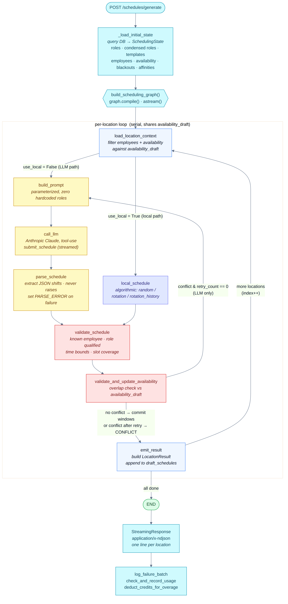
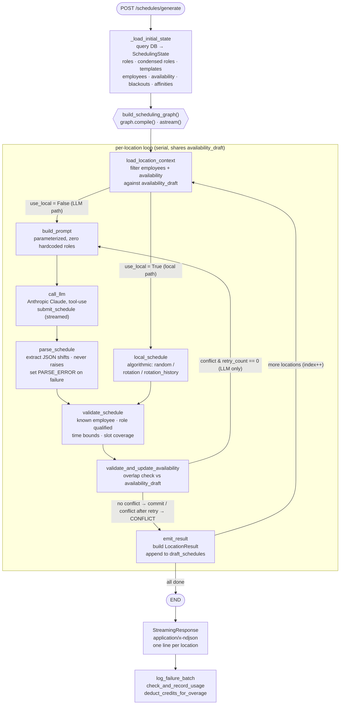

# LangGraph Scheduling Pipeline

The scheduling pipeline is a [LangGraph](https://github.com/langchain-ai/langgraph)
`StateGraph` embedded in the FastAPI backend (`backend/scheduling/`). It generates
optimized weekly shift schedules **one location at a time**, sharing a mutable
`availability_draft` across locations so an employee can't be double-booked.

`POST /api/v1/schedules/generate` builds the graph, compiles it, and streams the
result via `astream()` as NDJSON — one `LocationResult` line per location.



## The two paths

The graph is built by `build_scheduling_graph(use_local=...)` and has two
mutually exclusive entry flows after `load_location_context`:

- **LLM path** (`use_local=False`): `build_prompt → call_llm → parse_schedule`.
  Claude is called with a forced `submit_schedule` tool to return schema-constrained
  JSON. On a conflict, the loop retries **once** through `build_prompt` (with
  conflict notes appended) before marking shifts `CONFLICT`.
- **Local path** (`use_local=True`): a single `local_schedule` node runs the
  algorithmic scheduler (`random` / `rotation` / `rotation_history`). It skips
  the LLM entirely and never retries.

Both paths converge on `validate_schedule → validate_and_update_availability →
emit_result`, then the conditional edge either loops to the next location or
ends the run.

## Nodes

| Node | Responsibility |
| --- | --- |
| `_load_initial_state` | Query the DB → initial `SchedulingState` (roles, condensed roles, fused templates, employees, availability, blackouts, affinities). |
| `load_location_context` | Filter employees + availability for the current location against `availability_draft`. |
| `build_prompt` | Build the parameterized prompt (zero hardcoded role names). |
| `call_llm` | Invoke Anthropic Claude via streaming tool-use (`submit_schedule`). |
| `parse_schedule` | Extract the JSON shift array; on failure set `status="PARSE_ERROR"` — never raises. |
| `local_schedule` | Algorithmic scheduler used instead of the LLM when `use_local=True`. |
| `validate_schedule` | Business rules: known employee, role qualification, time bounds, slot coverage. |
| `validate_and_update_availability` | Overlap check vs `availability_draft`; retry once on conflict (LLM only), else commit consumed windows. |
| `emit_result` | Build a `LocationResult`, append to `draft_schedules`, set final status (`ok`/`CONFLICT`/`PARSE_ERROR`). |

## Source (renders natively on GitHub)



> Regenerate the image after editing `scheduling-pipeline.mmd`:
>
> ```bash
> npx -y @mermaid-js/mermaid-cli -i docs/scheduling-pipeline.mmd -o docs/scheduling-pipeline.png -b white -s 3
> ```
